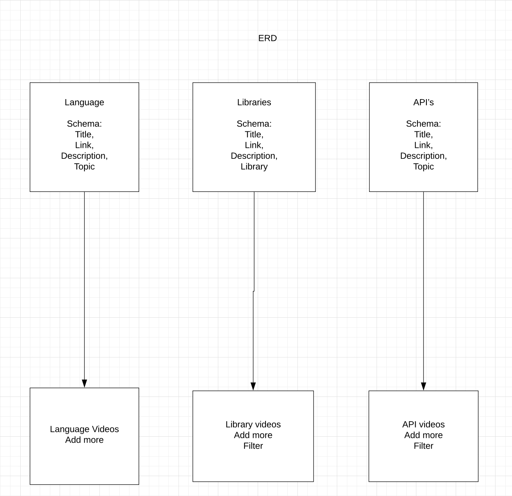

# Code Perg

### General Assembly SEI 26- Project 3

* Trello board- https://trello.com/b/pyfHWflL/project-3
  
* Git hub- https://git.generalassemb.ly/bellajco/Priject3

* Link to deployed site- https://codeperg.herokuapp.com/

## Overview
Code Pergatory was created as an open source collection of coding youtube videos so that the essentials are all and one place and easy to navigate. This app will cut down the amount of wasted hours someone spends on youtube trying to find the right videos to learn code. 

## Technology Used

* Javascript, Mongoose, MongoDB, Express, React, Node.js

ERD:

Final Product:

